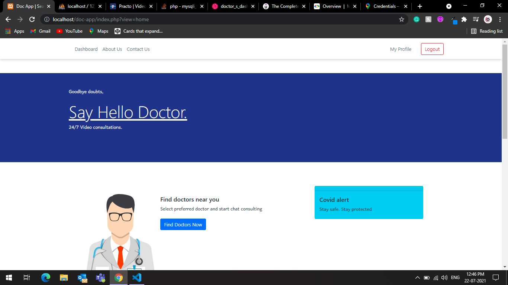
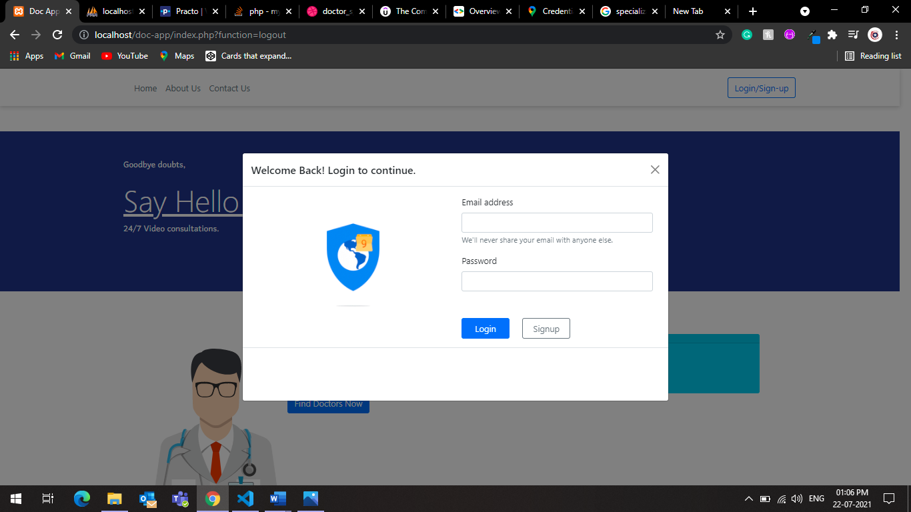
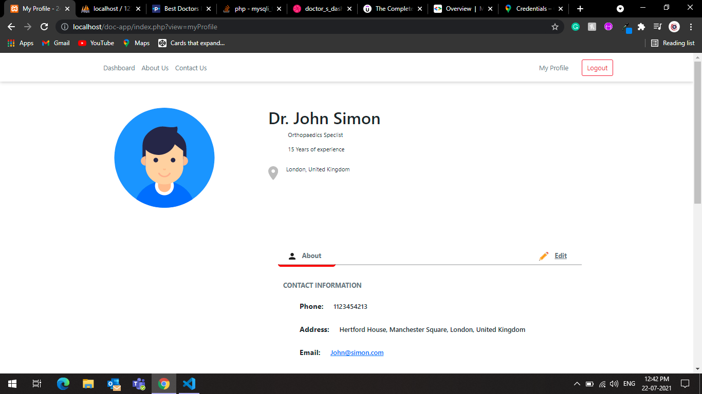
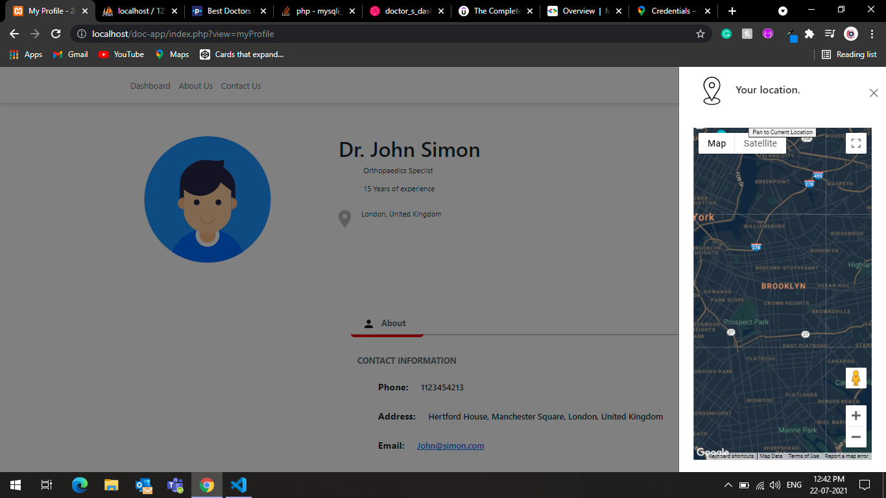
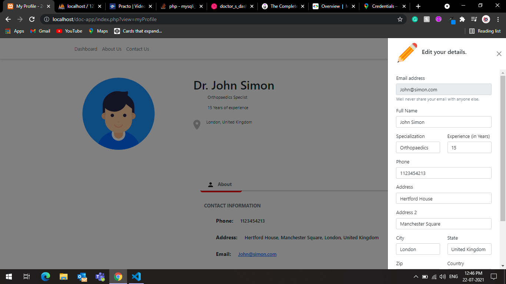
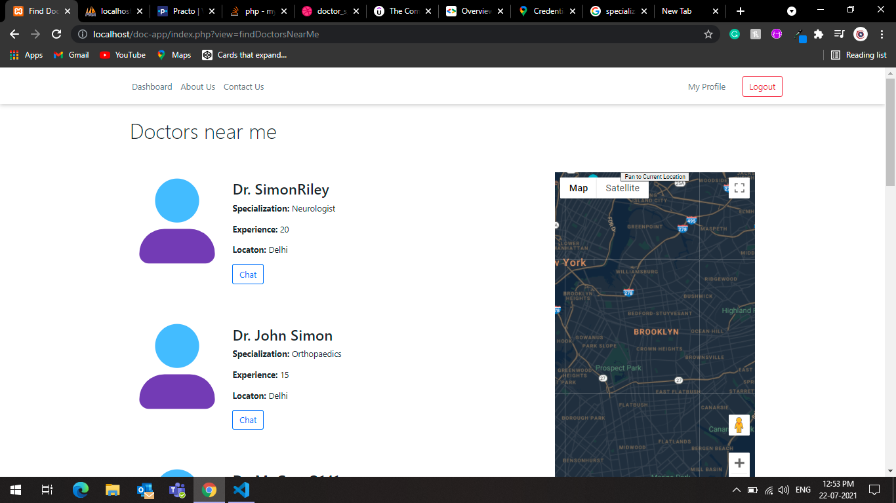

# Doctors App (Doctors Portal) 

# Introduction

Doc App is an online based consultation app bulid for both patients and doctors, to communicate and consult with doctors from their accommodation. This system help's you to find doctors according the specilisation and let's you chat with them to express your concern. This system also buildin Google maps feature, lets you find doctors near you.

# Technology used

- HTML
- CSS
- JavaScript
- jQuery
- PHP
- MySQL
- BootStrap

# Installation

To run this project, you must have installed a virtual server i.e XAMPP (for Windows) or MAMP (for Mac) on your PC.

After Starting Apache and MySQL services in XAMPP, follow the following steps. 

- **Step 1:** Extract file from the doc-app.zip folder. 
- **Step 2:** Copy the main project folder and Paste it into " xampp/htdocs/ " folder as named 'doc-app'. 
- **Step 3:** Open a browser and go to URL “http://localhost/phpmyadmin/” 
- **Step 4:** Then, click on the databases tab, create a database naming “doc-app” and then click on the import tab. 
- **Step 5:** Click on browse file and select “doc-app.sql” file from 'sql' folder of the 'doc-app'. 
- **Step 6:** Click on go.

After setting up the Database, 

- **7th Step:** Open a browser and go to URL “http://localhost/doc-app/”

**Note** After creating your account on the app make sure to also update your details first from the 'My Profile' tab for better visibility.

For demo purposes, you could use the folloing credentials for login 
- **email/username:** main@main.com 
- **password:** main

# Screenshots

# Homepage

# Login menu

# Public profile

# Edit your public profile

# Find doctors near you

# UPDATE 

This app would be updated very soon as it may contains some bugs and errors.

To get the latest version, download the souce code from following link
**" https://github.com/TusharPanja15/Doc-app "** 

# WARNING

This app is for educational purpose. Use it wisely.

**************************************

Created by: 
- Sachin
- Tushar Kumar
- Tushar Panja

**************************************
